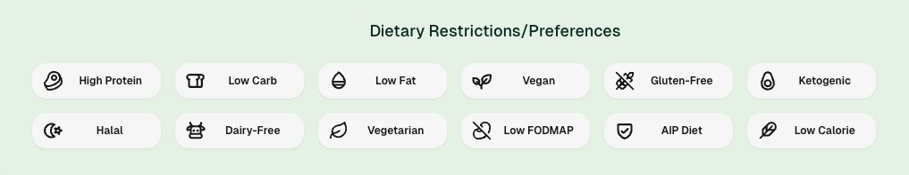
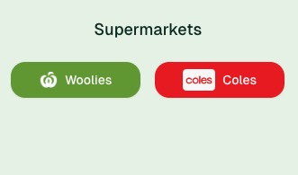
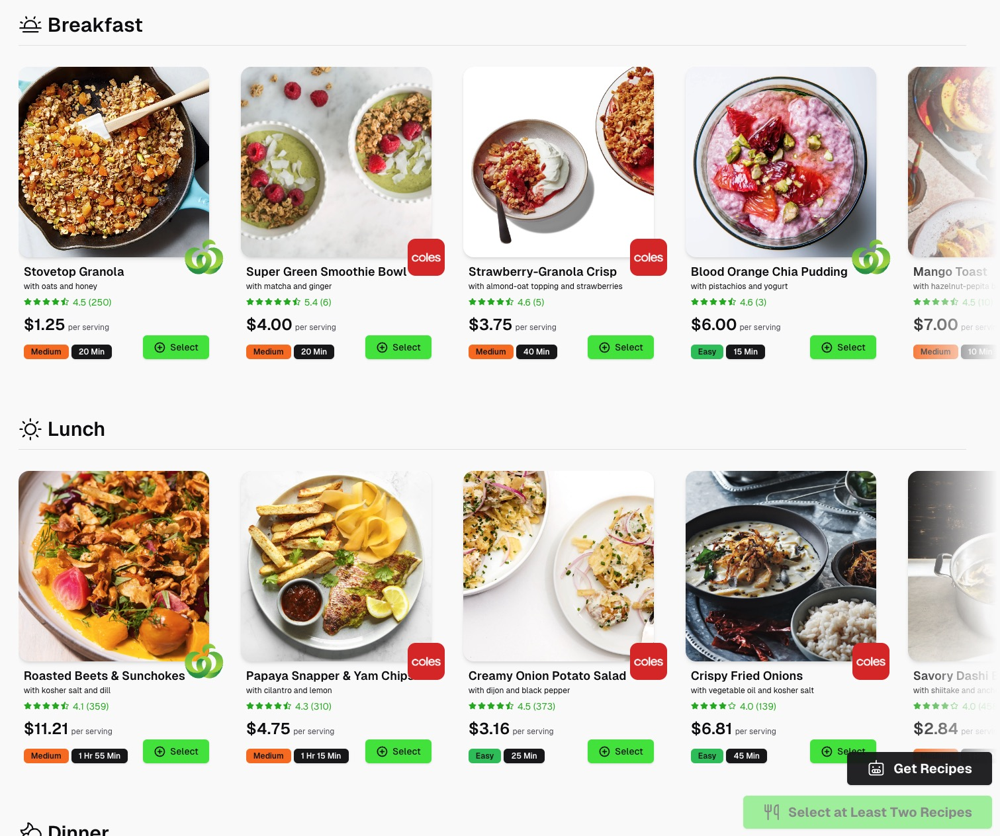
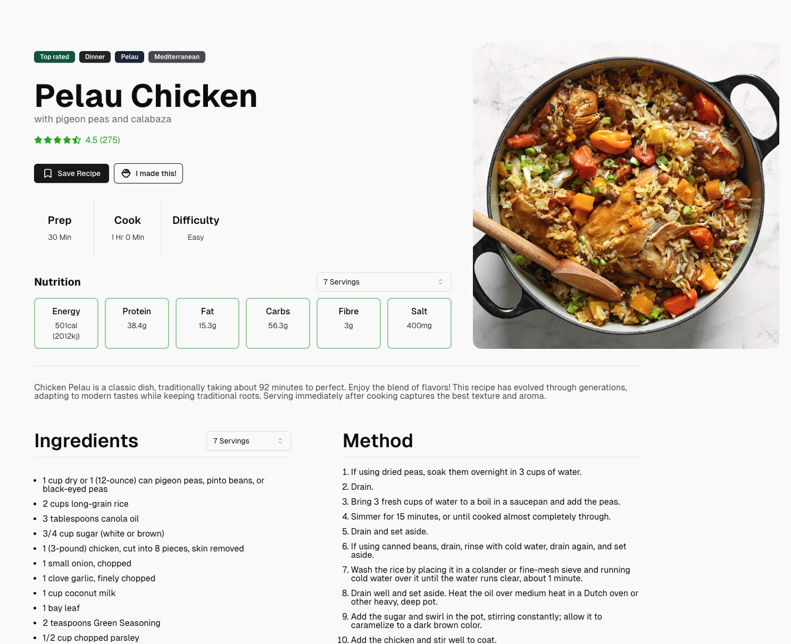
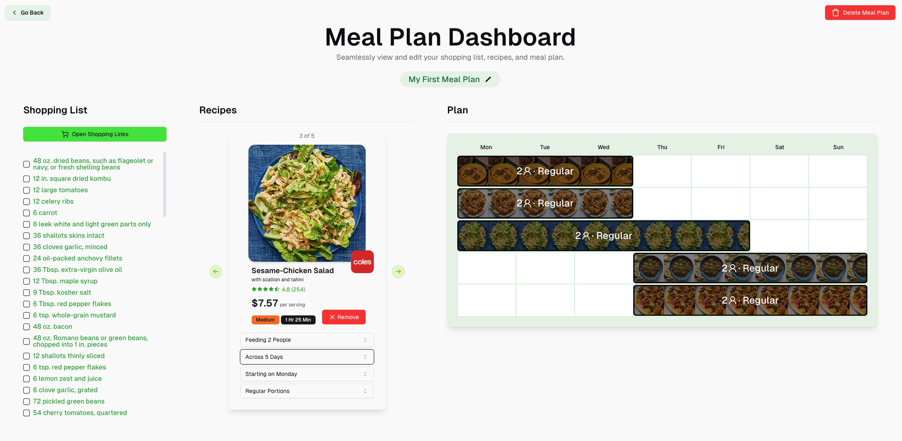

# Peckish - an AI recipe generator that uses current grocery sales and dietary preferences.
You can try the (VERY) early demo at https://peckish-ai.vercel.app/app/recipe-selector !

## 1. Select your dietary preferences

## 2. Filter for your preferred grocery stores

## 3. Press 'Get Recipes'

## 4. Click through the recipes, selecting your favourites.

## 5. After selecting two or more recipes, click 'Create Meal Plan' to view and manage your meal plan.

# Contribution
Contributions, issues, and feature requests are welcome!

# Known Issues
* The meal planner superficially cuts off at a week, with any bleed simply truncated. A carousel will be inserted in its place!
* There is no authentication in the demo - accounts cannot be made.

# License

This project is open source, licensed under MIT.
